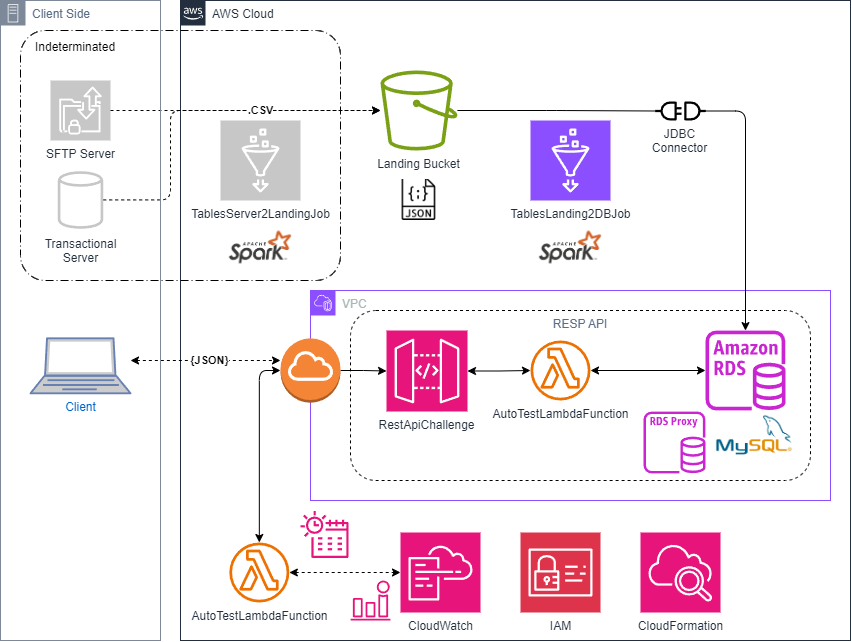

## AWS Infrastructure Overview for the Globant Challenge

In this project, we've designed a robust AWS infrastructure to support a scalable and reliable REST API. Our solution leverages several AWS services to ensure seamless operation and high availability. Below is an overview of the key components and how they interact to deliver the functionality required for the Globant challenge.

**1. API Gateway:**

* **Purpose:** Acts as the entry point for all client requests, providing a secure and scalable API interface.
* **Configuration:** Manages different API methods and routes, and integrates with Lambda functions to handle various operations.

**2. AWS Lambda:**

* **Purpose:** Handles business logic and processes requests without the need for managing servers.
* **Configuration:** Deployed functions manage API requests, perform data processing, and interact with other AWS services as needed.

**3. Amazon RDS (MySQL):**

* **Purpose:** Serves as the primary data store for the application.
* **Configuration:** Hosts the MySQL database with tables for departments, jobs, and employees, ensuring data persistence and reliability.

**4. Amazon S3:**

* **Purpose:** Provides storage for CSV files and other static content.
* **Configuration:** Used to upload and manage data files that are ingested into the RDS database through Lambda functions.

**5. AWS Glue:**

* **Purpose:** Facilitates ETL (Extract, Transform, Load) operations.
* **Configuration:** Applies transformations to data before loading it into the MySQL database, ensuring data is properly formatted and integrated.

**6. AWS CloudFormation:**

* **Purpose:** Automates the deployment and management of the AWS infrastructure.
* **Configuration:** Defines and provisions AWS resources using infrastructure-as-code principles to ensure consistent and repeatable deployments.

**7. API Monitoring and Logging:**

* **Purpose:** Ensures visibility into API performance and operational health.
* **Configuration:** Uses AWS CloudWatch to monitor Lambda function performance and logs API requests and errors for troubleshooting and optimization.

This infrastructure is designed to handle the demands of the Globant challenge efficiently while maintaining flexibility and scalability for future enhancements.

## Description of the AWS Glue Job for Bulk Data Insertion

This AWS Glue job is designed to perform bulk data insertion into a MySQL database from CSV files stored in an S3 bucket. It utilizes Spark's distributed processing capabilities to efficiently handle large datasets, ensuring that data is read, transformed, and written to the target database with minimal overhead.

### Job Overview

* **Data Extraction** : Reads CSV files from an S3 bucket, which contains the bulk data for three tables: `departments`, `jobs`, and `hired_employees`. Uses Spark's DataFrame API to load these files into memory, leveraging Spark’s ability to process large volumes of data efficiently.
* **Data Transformation** : Transforms the data to match the schema of the target MySQL database. This involves renaming columns and casting data types to ensure compatibility with the database schema.
* **Data Loading** : Writes the transformed data to the MySQL database using the JDBC driver. The job uses the overwrite mode to replace existing data in the target tables, allowing for straightforward bulk updates.

### Advantages for Bulk Data Insertion

* **Distributed Processing** : AWS Glue leverages Apache Spark, which can process large datasets in parallel across a cluster of machines. This distributed approach enables efficient handling of bulk data operations, reducing the time required for data processing and insertion.
* **Scalability** : Glue can scale resources dynamically based on the size of the data and the complexity of the transformations, making it suitable for handling both small and very large data volumes.
* **Ease of Use** : The Glue job abstracts the complexity of data processing and database interactions. It simplifies the ETL (Extract, Transform, Load) process by providing a high-level API to manage data operations, which can be easier to maintain and configure compared to lower-level solutions.
* **Integration with AWS Services** : Glue integrates seamlessly with other AWS services such as S3 and RDS, enabling a smooth data pipeline setup. It also supports various data formats and sources, offering flexibility in how data is ingested and processed.

### Considerations

* **Database Performance** : Ensure that the target MySQL database is properly configured to handle bulk inserts. Depending on the volume of data, you may need to optimize database performance through indexing, connection pooling, and other tuning measures.
* **Data Partitioning** : For very large datasets, consider partitioning the data to avoid overwhelming the database. This can be done by configuring the Glue job to process and load data in smaller batches, improving performance and reducing the risk of timeout errors.
* **Batch Size Configuration** : Adjusting batch sizes in the JDBC connection settings can optimize performance for large data volumes. Proper configuration can help balance the load on the database and improve insert efficiency.
* **Credentials Management** : Avoid hardcoding sensitive credentials in your script. Use AWS Secrets Manager or other secure methods to manage and retrieve database credentials, ensuring better security and compliance.
* **Error Handling** : Implement robust error handling and logging to capture and address issues during the data processing and insertion phases. This helps in identifying problems early and ensures data integrity.

---

## Description of a JDBC Connector

A JDBC (Java Database Connectivity) connector is a Java-based API that enables Java applications to interact with relational databases. It provides a standard method for connecting to and performing operations on databases, such as querying, updating, and managing data. JDBC connectors facilitate the communication between applications and databases by translating database-specific protocols into a common, standardized format that Java applications can use.

### Key Features of JDBC Connectors

* **Standardized Interface** : JDBC provides a consistent API for interacting with various relational databases, allowing developers to write database code that is independent of the database system being used.
* **Connection Management** : JDBC handles the creation, management, and termination of database connections, ensuring that applications can efficiently interact with the database.
* **Data Operations** : Through JDBC, applications can execute SQL statements, including SELECT, INSERT, UPDATE, and DELETE operations. It also supports transactions and batch processing.
* **Error Handling** : JDBC provides mechanisms for handling SQL exceptions and errors that occur during database operations, ensuring robust and reliable database interactions.
* **Driver Support** : JDBC connectors require a database-specific driver to communicate with the database. Drivers are provided by database vendors or third-party developers and must be included in the application’s classpath.

---

## Description of MySQL Instance in Amazon RDS

Amazon RDS (Relational Database Service) for MySQL is a managed database service that simplifies the setup, operation, and scaling of MySQL databases in the cloud. It provides a reliable and scalable database environment with automated backups, patch management, and failover support.

### Key Features of Amazon RDS for MySQL

* **Managed Service** : Amazon RDS handles routine database tasks such as backups, patching, and hardware provisioning, allowing you to focus on your application rather than database maintenance.
* **Scalability** : You can easily scale your database instance’s compute and storage resources to meet your application's needs. RDS supports both vertical and horizontal scaling options.
* **High Availability** : RDS offers features like Multi-AZ deployments and automated backups to ensure high availability and data durability. Multi-AZ deployments provide automatic failover to a standby instance in case of an outage.
* **Security** : RDS integrates with AWS Identity and Access Management (IAM), Virtual Private Cloud (VPC), and AWS Key Management Service (KMS) to provide secure database access and encryption.
* **Performance** : With support for various instance types and storage options (e.g., General Purpose SSD, Provisioned IOPS SSD), RDS for MySQL can be optimized for performance based on your workload requirements.
* **Monitoring and Alerts** : Amazon RDS provides monitoring through Amazon CloudWatch and the RDS console, allowing you to track database performance and set up alerts for critical metrics.

---

## Why CSV Files Are Suitable for Relational Databases

* **Structured Data** : CSV files contain tabular data with a consistent structure, making them well-suited for import into relational databases. Each row represents a record, and each column represents an attribute of that record, aligning well with relational database tables.
* **Ease of Import** : Many relational databases, including MySQL, provide built-in tools and features to import CSV files directly into tables. This process is straightforward and efficient for bulk data ingestion.
* **Data Integrity** : By storing CSV data in a relational database, you can enforce data integrity constraints such as primary keys, foreign keys, and unique constraints. This helps maintain data accuracy and consistency.
* **Querying and Analysis** : Relational databases offer powerful querying capabilities using SQL. Once CSV data is loaded into a database, you can perform complex queries, joins, and aggregations to analyze and derive insights from the data.
* **Data Relationships** : Relational databases are designed to handle complex relationships between data entities. By importing CSV files into a relational database, you can establish relationships between different tables and perform operations that reflect these relationships.
* **Indexing and Performance** : Relational databases support indexing, which can significantly improve query performance. After importing CSV data, you can create indexes on relevant columns to optimize access and retrieval.
* **Scalability** : While CSV files themselves are static and limited in scalability, relational databases provide the scalability needed to handle large volumes of data and support growth over time.
* **Data Management** : Relational databases offer robust tools for managing and maintaining data, including backup and recovery, transaction management, and data migration. Storing CSV data in a database leverages these capabilities for better data management.

---

## Description of RestApiLambdaFunction

### Lambda Function Overview

* **Purpose** : This Lambda function processes HTTP requests from API Gateway and interacts with a MySQL database based on the specified paths and HTTP methods (GET, POST, DELETE).
* **Environment Variables** : The function uses environment variables (RDS_HOST, DB_NAME) for database connectivity and credentials (db_username, db_password) for authentication.
* **Handlers** :
* **GET** : Retrieves data from various database tables or runs specific queries based on the request path.
* **POST** : Inserts new data into the database.
* **DELETE** : Removes data from the database.
* **Database Operations** :
* **Create/Drop Tables** : Creates or drops tables in the database.
* **Data Management** : Handles CRUD (Create, Read, Update, Delete) operations for jobs, departments, and hired employees.
* **Functions** :
* **lambda_handler** : Main entry point. Determines the HTTP method and path to delegate the request to the appropriate function.
* **Data Retrieval** : Functions like `get_jobs`, `get_departments`, etc., query the database and return results.
* **Data Manipulation** : Functions like `save_jobs`, `delete_jobs`, etc., perform insertions, deletions, or updates.
* **Table Management** : Functions like `create_jobs_table`, `drop_jobs_table`, etc., manage table schema changes.

### Benefits

* **Separation of Concerns** :
* **Modularity** : Each function handles specific types of database interactions or data processing, making the codebase modular and easier to maintain.
* **Scalability** : Lambda functions can scale automatically based on the number of incoming requests, accommodating fluctuating workloads.
* **Cost-Effectiveness** :
* **Pay-as-You-Go** : AWS Lambda charges based on the number of requests and execution time, which can be more cost-effective compared to provisioning and managing servers.
* **Security** :
* **Managed Environment** : AWS Lambda handles the infrastructure management, including security updates.
* **Secret Management** : Sensitive information (e.g., database credentials) can be stored securely in AWS Secrets Manager or encrypted environment variables.
* **Integration** :
* **API Gateway** : Acts as a front-door to your Lambda function, handling routing and request transformation.
* **Database** : Direct integration with RDS MySQL allows seamless interaction with your data.
* **Error Handling** :
* **Robust** : The function includes try-except blocks to handle exceptions and return appropriate error messages.
* **Efficiency** :
* **Connection Management** : Uses context management (`with connection.cursor()`) to ensure that connections are properly closed, reducing resource leaks.

This setup provides a robust, scalable, and cost-effective way to manage interactions between a web API and a MySQL database. It leverages AWS’s serverless architecture to handle requests dynamically, ensuring that you can focus more on your application logic rather than infrastructure management.

---

## Description of AutoTestingLambdaFunction

This Lambda function is designed for automated testing of three API endpoints. It performs the following actions:

* **Checks API Health** :
* **`/status` Endpoint** : Checks the overall status of the API.
* **`/hired_employees_2021` Endpoint** : Retrieves data on employees hired in 2021.
* **`/hired_employees_2021_quarters` Endpoint** : Retrieves data on employees hired in different quarters of 2021.
* **Logging and Error Handling** :
* Logs the status codes and responses from each endpoint.
* Handles request exceptions and logs errors if any endpoint returns a non-200 status code.
* **Response Formation** :
* Aggregates the results from each API endpoint into a single response.
* Provides detailed error messages if any endpoint fails.

### Why It’s Good to Have

* **Automated Monitoring** :
* Ensures that all critical API endpoints are functioning correctly without manual intervention.
* Helps in identifying issues in real-time, which is crucial for maintaining the reliability of the API.
* **Consistent Reporting** :
* Provides a standardized way to check the health of different endpoints and gather their statuses.
* Aggregates results in a single response, making it easier to review and analyze the API’s health.
* **Improved Error Handling** :
* Logs detailed information about API responses and errors, aiding in debugging and troubleshooting.
* Helps quickly pinpoint which endpoint is having issues, reducing the time to resolve problems.
* **Continuous Integration and Deployment** :
* Can be integrated into CI/CD pipelines to automatically test the API endpoints as part of deployment processes.
* Ensures that any changes or updates to the API do not break existing functionality.
* **Operational Efficiency** :
* Reduces the need for manual testing, saving time and effort.
* Provides a systematic approach to monitor API health, enhancing overall operational efficiency.
