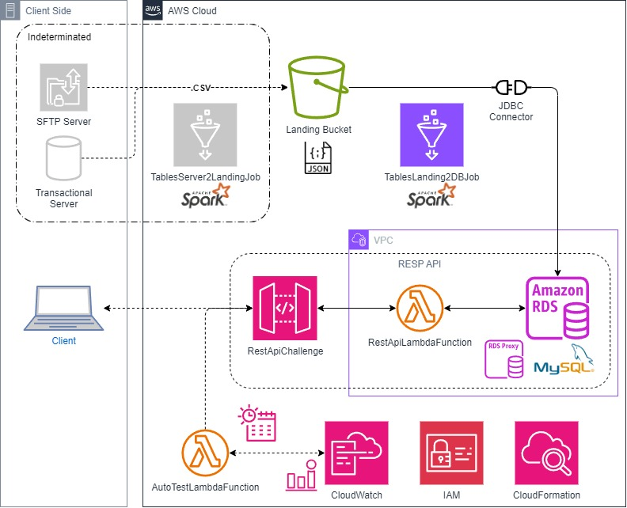

## AWS Infrastructure Overview for the Globant Challenge

In this project, I've designed a robust AWS infrastructure to support a scalable and reliable REST API. Our solution leverages several AWS services to ensure seamless operation and high availability. Below is an overview of the key components and how they interact to deliver the functionality required for the Globant Challenge.

**1. API Gateway:**

* Acts as the entry point for all client requests, providing a secure and scalable API interface. Manages different API methods and routes, and integrates with Lambda functions to handle various operations.

**2. AWS Lambda:**

* Handles business logic and processes requests without the need for managing servers. Deployed functions manage API requests, perform data processing, and interact with other AWS services as needed.

**3. Amazon RDS (MySQL):**

* Serves as the primary data store for the application. Hosts the MySQL database with tables for departments, jobs, and hired employees, ensuring data persistence and reliability.

**4. Amazon S3:**

* Provides storage for CSV files and other static content. Used to upload and manage data files that are ingested into the RDS database through Lambda functions.

**5. AWS Glue:**

* Facilitates ETL (Extract, Transform, Load) operations. Applies transformations to data before loading it into the MySQL database, ensuring data is properly formatted and integrated.

**6. AWS CloudFormation:**

* Automates the deployment and management of the AWS infrastructure. Defines and provisions AWS resources using infrastructure-as-code principles to ensure consistent and repeatable deployments.

**7. API Monitoring and Logging:**

* Ensures visibility into API performance and operational health. Uses AWS CloudWatch to monitor Lambda function performance and logs API requests and errors for troubleshooting and optimization.

This infrastructure is designed to handle the demands of the Globant challenge efficiently while maintaining flexibility and scalability for future enhancements.

## AWS Infrastructure Diagram for the Globant Challenge

## RestApiChallenge - API Technical Documentation

### Overview

The `RestApiChallenge` is a RESTful API hosted on AWS API Gateway, designed to manage and interact with a database that handles departmental, employee, and job-related data. This API provides endpoints to create and drop tables, manage department and job records, and query employee data, including specific queries for the year 2021.

### Resources and Methods

#### `/hired_employees_2021`

* **GET** : Retrieves employee records specifically for the year 2021.
* **OPTIONS** : Provides the supported HTTP methods for this resource.

#### `/hired_employees_2021_quarters`

* **GET** : Retrieves employee records for 2021, grouped by quarters.
* **OPTIONS** : Provides the supported HTTP methods for this resource.

### Additional Resources and Methods

#### `/status`

* **GET** : Retrieves the current status of the API or related services.
* **OPTIONS** : Provides the supported HTTP methods for this resource

#### `/jobs`

* **DELETE** : Deletes an existing job record from the database.
* **GET** : Retrieves a list of all job records from the database.
* **POST** : Adds a new job record to the database.
* **OPTIONS** : Provides the supported HTTP methods for this resource.

#### `/departments`

* **DELETE** : Deletes an existing department record from the database.
* **GET** : Retrieves a list of all department records from the database.
* **POST** : Adds a new department record to the database.
* **OPTIONS** : Provides the supported HTTP methods for this resource.

#### `/hired_employees`

* **DELETE** : Deletes an existing employee record from the database.
* **GET** : Retrieves a list of all employee records from the database.
* **POST** : Adds a new employee record to the database.
* **OPTIONS** : Provides the supported HTTP methods for this resource.

#### `/create_departments_table`

* **GET** : Initiates the creation of the `departments` table in the database.
* **OPTIONS** : Provides the supported HTTP methods for this resource.

#### `/create_hired_employees_table`

* **GET** : Initiates the creation of the `hired_employees` table in the database.
* **OPTIONS** : Provides the supported HTTP methods for this resource.

#### `/create_jobs_table`

* **GET** : Initiates the creation of the `jobs` table in the database.
* **OPTIONS** : Provides the supported HTTP methods for this resource.

#### `/drop_departments_table`

* **GET** : Initiates the deletion of the `departments` table from the database.
* **OPTIONS** : Provides the supported HTTP methods for this resource.

#### `/drop_hired_employees_table`

* **GET** : Initiates the deletion of the `hired_employees` table from the database.
* **OPTIONS** : Provides the supported HTTP methods for this resource.

#### `/drop_jobs_table`

* **GET** : Initiates the deletion of the `jobs` table from the database.
* **OPTIONS** : Provides the supported HTTP methods for this resource.

## Description of RestApiLambdaFunction

### Lambda Function Overview

* **Purpose** : This Lambda function processes HTTP requests from the `RestApiChallenge` API Gateway and interacts with a MySQL database based on the specified paths and HTTP methods (GET, POST, DELETE).
* **Environment Variables** : The function uses environment variables (RDS_HOST, DB_NAME) for database connectivity and credentials for authentication.
* **Handlers** :
  * **GET** : Retrieves data from various database tables or runs specific queries based on the request path.
  * **POST** : Inserts new data into the database.
  * **DELETE** : Removes data from the database.
* **Database Operations** :
  * **Create/Drop Tables** : Handles the creation and dropping of database tables.
  * **Data Management** : Manages CRUD (Create, Read, Update, Delete) operations for jobs, departments, and hired employees.
* **Functions** :
  * **lambda_handler** : The main entry point that determines the HTTP method and path to delegate the request to the appropriate function.
  * **Data Retrieval** : Functions like `get_jobs`, `get_departments`, `get_hired_employees`, etc., query the database and return results.
  * **Data Manipulation** : Functions like `save_jobs`, `save_departments`, `delete_jobs`, `delete_departments`, etc., perform insertions, deletions, or updates.
  * **Table Management** : Functions like `create_jobs_table`, `create_departments_table`, `drop_jobs_table`, `drop_departments_table`, etc., manage table schema changes.

## Description of AutoTestingLambdaFunction

This Lambda function is designed for automated testing of three API endpoints. It performs the following actions:

* **Checks API Health** :
* **`/status` Endpoint** : Checks the overall status of the API.
* **`/hired_employees_2021` Endpoint** : Retrieves status & data on employees hired in 2021.
* **`/hired_employees_2021_quarters` Endpoint** : Retrieves status & data on employees hired in different quarters of 2021.
* **Logging and Error Handling** :
* Logs the status codes and responses from each endpoint.
* Handles request exceptions and logs errors if any endpoint returns a non-200 status code.
* **Response Formation** :
* Aggregates the results from each API endpoint into a single response.
* Provides detailed error messages if any endpoint fails.

## Description of the AWS Glue Job for Bulk Data Insertion

This AWS Glue job is designed to perform bulk data insertion into a MySQL database from CSV files stored in an S3 bucket. It utilizes Spark's distributed processing capabilities to efficiently handle large datasets, ensuring that data is read, transformed, and written to the target database with minimal overhead.

### Job Overview

* **Data Extraction** : Reads CSV files from `landing` S3 bucket, which contains the bulk data for three tables: `departments`, `jobs`, and `hired_employees`. Uses Spark's DataFrame API to load these files into memory, leveraging Spark's ability to process large volumes of data efficiently.
* **Data Transformation** : Transforms the data to match the schema of the target MySQL database. This involves renaming columns and casting data types to ensure compatibility with the database schema.
* **Data Loading** : Writes the transformed data to the MySQL database using the JDBC driver. The job uses the overwrite mode to replace existing data in the target tables, allowing for straightforward bulk updates.

### Considerations

* **Database Performance** : Ensure that the target MySQL database is properly configured to handle bulk inserts. Depending on the volume of data, you may need to optimize database performance through indexing, connection pooling, and other tuning measures.
* **Data Partitioning** : For very large datasets, consider partitioning the data to avoid overwhelming the database. This can be done by configuring the Glue job to process and load data in smaller batches, improving performance and reducing the risk of timeout errors.
* **Batch Size Configuration** : Adjusting batch sizes in the JDBC connection settings can optimize performance for large data volumes. Proper configuration can help balance the load on the database and improve insert efficiency.
* **Credentials Management** : Avoid hardcoding sensitive credentials in your script. Use AWS Secrets Manager or other secure methods to manage and retrieve database credentials, ensuring better security and compliance.
* **Error Handling** : Implement robust error handling and logging to capture and address issues during the data processing and insertion phases. This helps in identifying problems early and ensures data integrity.

---

## Description of a JDBC Connector

A JDBC (Java Database Connectivity) connector is a Java-based API that enables Java applications to interact with relational databases. It provides a standard method for connecting to and performing operations on databases, such as querying, updating, and managing data. JDBC connectors facilitate the communication between applications and databases by translating database-specific protocols into a common, standardized format that Java applications can use.

### Key Features of JDBC Connectors

* **Standardized Interface** : JDBC provides a consistent API for interacting with various relational databases, allowing developers to write database code that is independent of the database system being used.
* **Connection Management** : JDBC handles the creation, management, and termination of database connections, ensuring that applications can efficiently interact with the database.
* **Data Operations** : Through JDBC, applications can execute SQL statements, including SELECT, INSERT, UPDATE, and DELETE operations. It also supports transactions and batch processing.
* **Error Handling** : JDBC provides mechanisms for handling SQL exceptions and errors that occur during database operations, ensuring robust and reliable database interactions.
* **Driver Support** : JDBC connectors require a database-specific driver to communicate with the database. Drivers are provided by database vendors or third-party developers and must be included in the application’s classpath.

---

## Description of MySQL Instance in Amazon RDS

Amazon RDS (Relational Database Service) for MySQL is a managed database service that simplifies the setup, operation, and scaling of MySQL databases in the cloud. It provides a reliable and scalable database environment with automated backups, patch management, and failover support.

### Key Features of Amazon RDS for MySQL

* **Managed Service** : Amazon RDS handles routine database tasks such as backups, patching, and hardware provisioning, allowing you to focus on your application rather than database maintenance.
* **Scalability** : You can easily scale your database instance’s compute and storage resources to meet your application's needs. RDS supports both vertical and horizontal scaling options.
* **High Availability** : RDS offers features like Multi-AZ deployments and automated backups to ensure high availability and data durability. Multi-AZ deployments provide automatic failover to a standby instance in case of an outage.
* **Security** : RDS integrates with AWS Identity and Access Management (IAM), Virtual Private Cloud (VPC), and AWS Key Management Service (KMS) to provide secure database access and encryption.
* **Performance** : With support for various instance types and storage options (e.g., General Purpose SSD, Provisioned IOPS SSD), RDS for MySQL can be optimized for performance based on your workload requirements.
* **Monitoring and Alerts** : Amazon RDS provides monitoring through Amazon CloudWatch and the RDS console, allowing you to track database performance and set up alerts for critical metrics.

---
